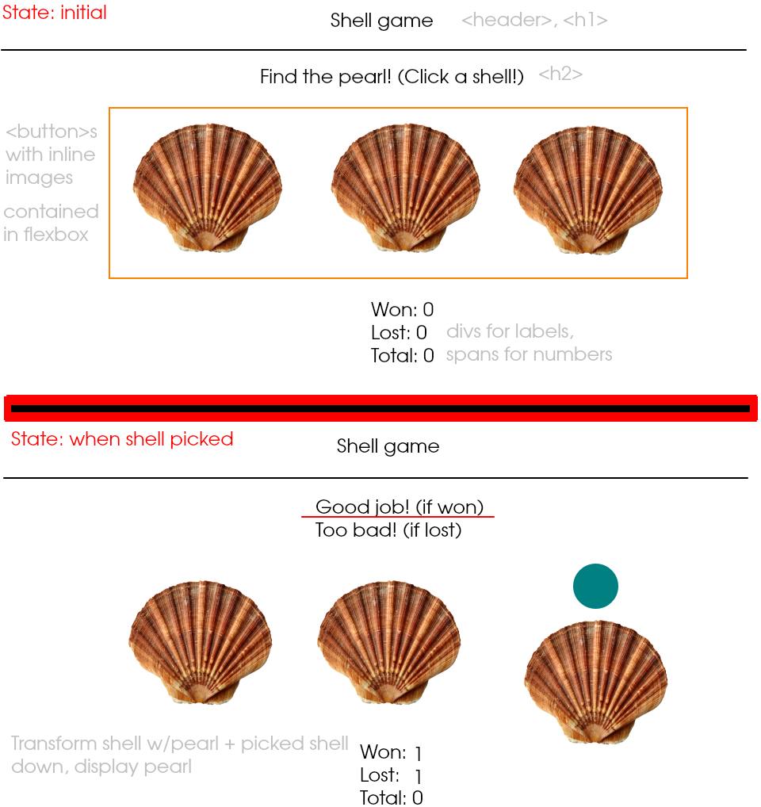

# Shell Game

In-browser guessing game: pick the shell with the pearl hidden in it to win!

## States

1. Pick shell state: waiting for user to pick which shell, instruction header above
2. Results screen state: reveal pearl, transform shell down, update stats, header

## Events

-   _user clicks any shell:_ change header, update scores, transform shell down, reveal pearl
-   _(stretch goal) try again button:_ change header, reset shell transform, hide pearl

## Functions

-   `displayResults(shellLocation, shellSelected, outcome)`: shows pearl and transforms shell in appropriate location, changes header with win/lose message
-   `resetGame(pearlLocation)`: reset shell transform, hide pearl, reset game visuals
-   `updateStats(gameOutcome)`: update internally tracked stats, update stat display on page
-   `setRandomPearlLocation(shellCount)`: returns random location for pearl
